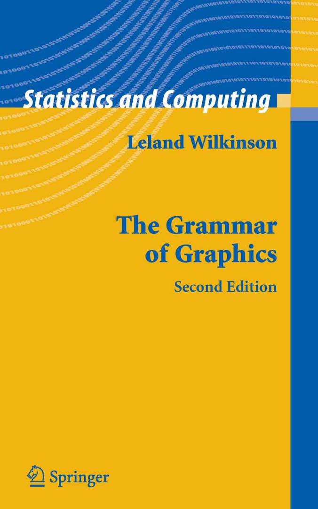
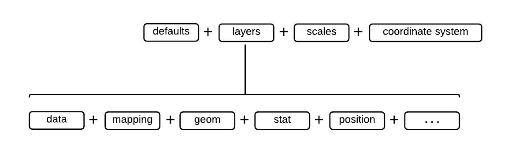

# Grammer of Graphics

| | |
|--------------------------------------------|---------------|
|Wilkinson, L. (2006). *The grammar of graphics*. Springer Science & Business Media.||

## Building Blocks of a Graph

  - data
  - aesthetic mapping
  - geometric object
  - statistical transformations
  - scales
  - coordinate system
  - position adjustments
  - faceting
  

  

